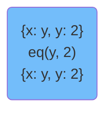

---
presentation:
  enableSpeakerNotes: true
---

<!-- slide -->
# miniKanren in JavaScript
The **logic.js** library
<aside class="notes">
My implementation is a slightly modifed version of miniKanren
</aside>

<!-- slide vertical:true -->
## Logic variables  
```
Either x is the beginning of the list ["banana", "orange", "apple"],
or x is the number 1.
```
<aside class="notes">
The purpose of a logic program is to take an expression with some unknowns in it and try to find values for those unknowns that make the expression true. Here's an example logic program in English with an unknown x:
</aside>


<!-- slide vertical:true -->
```
Either x is the beginning of the list ["banana", "orange", "apple"],
or x is the number 1.
```
(The two values of x that make this expression true are `1` and `banana`)  
<aside class="notes">
These unknowns are called logic variables, or lvars for short.
</aside>

<!-- slide vertical:true -->
## Define logic variables  
```javascript
const q = lvar('q') // {id: "q"}
const x = lvar()    // {id: "~.0"}
const y = lvar()    // {id: "~.1"}
```

<!-- slide vertical:true -->
## Substitution & Walking
<aside class="notes">
In the course of running a logic program, we'll be deciding on values for logic variables and testing those values against other parts of the program to see if it meets all the necessary criteria. The values are stored in a data structure called a substitution map (sMap for short).
</aside>

<!-- slide vertical:true -->
## ImmutableMap
```javascript
const x = new ImmutableMap() // x => {}
const y = x.set('a', 12)     // x => {}, y => {a: 12}
console.log( x === y )       // false
x.get('a')                   // undefined
y.get('a')                   // 12
```
<aside class="notes">
A substitution map is just a regular immutable map, and here is an example.
</aside>

<!-- slide vertical:true -->
Given the expression:
```
Either x is the beginning of the list ["banana", "orange", "apple"],
or x is the number 1.
```  
<br>
`{x: "banana"}` is a substitution map that makes this expression true

<!-- slide vertical:true -->
```
Either x is the beginning of the list [y, "orange", "apple"],
or y is the number 1.
```  

One substitution map which makes this expression true is:  
`{x: y, y: 1}`
<aside class="notes">
There is a twist to the substitution map: in addition to regular values, lvars can be used in the value position as well. (This is called a triangular substitution) Here is an example which implies a triangular substitution:
</aside>

<!-- slide vertical:true -->
## Looking up values

<aside class="notes">
We use the walk function to get the value of a logic variable from a substitution map.
</aside>

```javascript
function walk(key, sMap) {
  if (isLVar(key)) {
    const val = sMap.get(key)
    if (val === undefined) return key // not found
    return walk(val, sMap) // continue
  } else {
    return key
  }
}

walk(x, {})           // => x
walk(x, {x: y, y: 3}) // => 3
```

<!-- slide vertical:true -->
## Unification
```javascript
// unify(u, v, sMap)
unify(x, "banana", {}) // ==> {x: "banana"}
unify("banana", x, {}) // ==> {x: "banana"}
```
<aside class="notes">
Unification is the way we build up substitution maps.  
We unify two terms if they are equal.
</aside>

<!-- slide vertical:true -->
```javascript
unify(x, "banana", {x: "banana"}) // {x: "banana"}

unify(x, "banana", {x: "mango"})  // null
// failed to unify two terms
```
<aside class="notes">
What should we do if the logical variable already has a value?
There are two possibilities.  
</aside>

<!-- slide vertical:true -->  
```javascript
function unify(x, y, sMap) {
  x = walk(x, sMap)
  y = walk(y, sMap)
  if (x === y) {
    return sMap
  } else if (isLVar(x)) {
    return sMap.set(x, y)
  } else if (isLVar(y)) {
    return sMap.set(y, x)
  } else { // failed to unify
    return null
  }
}

unify(x, 12, {})    // => {x: 12}
unify(x, y, {})     // => {x: y}
unify(x, 1, {x: 2}) // => null
unify(x, m, {x: 3, m: n}) // => {x: 3, m: n, n: 3}
```

<!-- slide vertical:true -->
## Core miniKanren
| Scheme  | logic.js (JavaScript)  |
|---|---|
| == | eq  |
| fresh | we don't have that |
| conde | or |
| they don't have that | and |

<aside class="notes">
miniKanren is designed to be small and portable.  
It has the following four major operations.    
And I will talk about them one by one.
</aside>

<!-- slide vertical:true -->
## eq  
```javascript
eq(x, 1)

eq(x, y)
```
<aside class="notes">
eq will unify two terms, for example:  
</aside>

<!-- slide vertical:true -->
# eq
```javascript
function eq(x, y) {
  return function*(sMap) {
    return unify(x, y, sMap) // unify x and y
  }
}
```

<!-- slide vertical:true -->
## fresh (scheme version)
`fresh`, which syntactically looks like `lambda`, introduces lexically-scoped Scheme variables that are bound to new logic variables; fresh also performs conjunction of the relations within its body. Thus
```scheme
(fresh (x y z) (== x z) (== 3 y))
```

<!-- slide vertical:true -->
## fresh in JavaScript?
in Scheme  
```scheme
(fresh (x y z) (== x z) (== 3 y))
```
in JavaScript **ES6**
```javascript
(x=lvar(), y=lvar(), z=lvar())=> and(
  eq(x, z),
  eq(3, y))
```
<aside class="notes">
We use arrow function and default parameters from ES6 to define an anonymous function that is equivalent to the fresh function in scheme above.   
We bound logic variables x, y, z to that function.  
</aside>

<!-- slide vertical:true -->  
## and, or
```javascript
const x = lvar('x'),
      y = lvar('y')

or(eq(x, 1), eq(x, 2))

and(eq(x, y), eq(y, 1))

or(
  eq(x, 1),
  (x=lvar())=> eq(x, 2))
```
<aside class="notes">
The and performs conjunction operation.
The or performs disjunction operation.  
For example, the first example means we want x to be equal to 1...
</aside>

<!-- slide vertical:true -->
```javascript
function or(...clauses) {
  return function*(sMap) {
    const helper = function(offset, sMap) {
      const gen = clause(sMap) // clause is a goal(generator)
      while (true) {
        const res = gen.next(),
              sMap = res.value
        if (res.done) break
        if (sMap) yield sMap
      }
      yield* helper(offset + 1, sMap)
    }
    yield* helper(0, sMap)
  }
}
```
<aside class="notes">
This function is a bit difficult to explain, so I will give an graph example later on.
Each clause will take the same sMap that we passed in at the most begining.  
</aside>

<!-- slide vertical:true -->
```javascript
function and(...clauses) {
  return function*(sMap) {
    const helper = function(offset, sMap) {
      const clause = clauses[offset] // clause is a goal(generator)
      const gen = clause(sMap)
      while (true) {
        const res = gen.next()
        if (res.done) break
        const sMap = res.value
        if (sMap) {
          if (offset === clauses.length - 1)
            yield sMap
          else
            yield* helper(offset+1, sMap)
        } else { // failed to unify
          yield null
        }
      }
    }
    yield* helper(0, sMap)
  }
}
```
<aside class="notes">
The and function is similar to the or function. Except that it will check all clauses sequentially. It will yield null if one clause failed to unify. If it reaches the last clause and producess a valid substitution map, then it will yield that substitution map. Otherwise it will continue check the next clause.
</aside>

<!-- slide vertical:true -->
## Define facts and rules
In prolog
```prolog
parent(amy,bob).      % amy is the parent of bob.
parent(bob,marco).
parent(bob,mike).
grandparent(X,Z) :- parent(X,Y) , parent(Y,Z).
```
<!-- slide vertical:true -->
in prolog
```prolog
parent(amy,bob).      % amy is the parent of bob.
parent(bob,marco).
parent(bob,mike).
grandparent(X,Z) :- parent(X,Y) , parent(Y,Z).
```
in logic.js (miniKanren)
```javascript
function parent(x, y) {
  return or(
    and(eq(x, 'amy'), eq(y, 'bob')),
    and(eq(x, 'bob'), eq(y, 'marco')),
    and(eq(x, 'bob'), eq(y, 'mike'))
  )
}
function grandparent(x, z) {
  const y = lvar()
  return and(parent(x, y), parent(y, z))
}
```


<aside class="notes">
We can use the eq, or, and to define a goal.
</aside>

<!-- slide vertical:true -->  
## Solve a Goal
```javascript
run(1, [x], succeed())  
// [{x: x}]

run(1, [x], fail())  
// []

run(1, [x], eq(x, 1))
// [{x: 1}]

run([x], grandparent(x, 'mike'))
// [{x: 'amy'}]
run([x, y], grandparent(x, y))
// [{x: 'amy', y: 'marco'}, {x: 'amy', y: 'mike'}]

run(1, [x], and(
  eq(x, y),
  or(eq(x, 1), eq(x, 2), eq(x, 3)),
  eq(y, 2)))
// [{x: 2}]
```
<aside class="notes">
To solve a goal, we use the run function.  
run function takes three arguments.  
the first one indicates how many results you want to query.  
the second one is what logic variables you want to query.  
the third argument is the goal.
</aside>

<!-- slide vertical:true -->
```javascript
run(1, [x], and(
  eq(x, y),
  or(eq(x, 1), eq(x, 2), eq(x, 3)),
  eq(y, 2)))
```
<aside class="notes">
How does the run function work?
</aside>

```mermaid
graph TD
  style and fill:#f14343;
  eqy("eq(y, 2)")
  eqxy("eq(x, y)")

  subgraph ""
    eq1("eq(x, 1)")
    eq2("eq(x, 2)")
    eq3("eq(x, 3)")
    or --> eq1
    or --> eq2
    or --> eq3
  end
  and --> eqxy
  eqxy --> or
  or --> eqy
```

<!-- slide vertical:true -->
`run(1, [x], ...)`
```mermaid
graph TD
  style and fill:#ccc8f5;
  and("and {}")
  eqy("eq(y, 2)")
  eqxy("eq(x, y)")

  subgraph ""
    eq1("eq(x, 1)")
    eq2("eq(x, 2)")
    eq3("eq(x, 3)")
    or --> eq1
    or --> eq2
    or --> eq3
  end
  and --> eqxy
  eqxy --> or
  or --> eqy
```

<!-- slide vertical:true -->
```mermaid
graph TD
  style and fill:#ccc8f5;
  style eqxy fill:#f14343;
  and("and {}")
  eqy("eq(y, 2)")
  eqxy("{}<br>eq(x, y)")

  subgraph ""
    eq1("eq(x, 1)")
    eq2("eq(x, 2)")
    eq3("eq(x, 3)")
    or --> eq1
    or --> eq2
    or --> eq3
  end
  and --> eqxy
  eqxy --> or
  or --> eqy
```

<!-- slide vertical:true -->
```mermaid
graph TD
  style and fill:#ccc8f5;
  style eqxy fill:#ccc8f5;
  and("and {}")
  eqy("eq(y, 2)")
  eqxy("{}<br>eq(x, y)<br>{x: y}")

  subgraph ""
    eq1("eq(x, 1)")
    eq2("eq(x, 2)")
    eq3("eq(x, 3)")
    or --> eq1
    or --> eq2
    or --> eq3
  end
  and --> eqxy
  eqxy --> or
  or --> eqy
```

<!-- slide vertical:true -->
```mermaid
graph TD
  style and fill:#ccc8f5;
  style eqxy fill:#ccc8f5;
  style or fill:#f14343;
  and("and {}")
  eqy("eq(y, 2)")
  eqxy("{}<br>eq(x, y)<br>{x: y}")
  or("{x: y} <br> or ")

  subgraph ""
    eq1("eq(x, 1)")
    eq2("eq(x, 2)")
    eq3("eq(x, 3)")
    or --> eq1
    or --> eq2
    or --> eq3
  end
  and --> eqxy
  eqxy --> or
  or --> eqy
```

<!-- slide vertical:true -->
```mermaid
graph TD
  style and fill:#ccc8f5;
  style eqxy fill:#ccc8f5;
  style or fill:#ccc8f5;
  and("and {}")
  eqy("eq(y, 2)")
  eqxy("{}<br>eq(x, y)<br>{x: y}")
  or("{x: y} <br> or ")

  subgraph ""
    style eq1 fill:#f14343;
    eq1("eq(x, 1)")
    eq2("eq(x, 2)")
    eq3("eq(x, 3)")
    or --> eq1
    or --> eq2
    or --> eq3
  end
  and --> eqxy
  eqxy --> or
  or --> eqy
```

<!-- slide vertical:true -->
```mermaid
graph TD
  style and fill:#ccc8f5;
  style eqxy fill:#ccc8f5;
  style or fill:#ccc8f5;
  and("and {}")
  eqy("eq(y, 2)")
  eqxy("{}<br>eq(x, y)<br>{x: y}")
  or("{x: y} <br> or <br> {x: y, y: 1}")

  subgraph ""
    style eq1 fill:#ccc8f5;
    eq1("eq(x, 1)")
    eq2("eq(x, 2)")
    eq3("eq(x, 3)")
    or --> eq1
    or --> eq2
    or --> eq3
  end
  and --> eqxy
  eqxy --> or
  or --> eqy
```

<!-- slide vertical:true -->
```mermaid
graph TD
  style and fill:#ccc8f5;
  style eqxy fill:#ccc8f5;
  style or fill:#ccc8f5;
  style eqy fill:#f14343;
  and("and {}")
  eqy("{x: y, y: 1}<br>eq(y, 2)")
  eqxy("{}<br>eq(x, y)<br>{x: y}")
  or("{x: y} <br> or <br> {x: y, y: 1}")

  subgraph ""
    style eq1 fill:#ccc8f5;
    eq1("eq(x, 1)")
    eq2("eq(x, 2)")
    eq3("eq(x, 3)")
    or --> eq1
    or --> eq2
    or --> eq3
  end
  and --> eqxy
  eqxy --> or
  or --> eqy
```

<!-- slide vertical:true -->
```mermaid
graph TD
  style and fill:#ccc8f5;
  style eqxy fill:#ccc8f5;
  style or fill:#ccc8f5;
  style eqy fill:#f09c60;
  and("and {}")
  eqy("{x: y, y: 1}<br>eq(y, 2)<br>failed to unify")
  eqxy("{}<br>eq(x, y)<br>{x: y}")
  or("{x: y} <br> or <br> {x: y, y: 1}")

  subgraph ""
    style eq1 fill:#ccc8f5;
    eq1("eq(x, 1)")
    eq2("eq(x, 2)")
    eq3("eq(x, 3)")
    or --> eq1
    or --> eq2
    or --> eq3
  end
  and --> eqxy
  eqxy --> or
  or --> eqy
```

<!-- slide vertical:true -->
```mermaid
graph TD
  style and fill:#ccc8f5;
  style eqxy fill:#ccc8f5;
  style or fill:#f14343;
  and("and {}")
  eqy("eq(y, 2)")
  eqxy("{}<br>eq(x, y)<br>{x: y}")
  or("{x: y} <br> or")

  subgraph ""
    style eq1 fill:#ccc8f5;
    eq1("eq(x, 1)")
    eq2("eq(x, 2)")
    eq3("eq(x, 3)")
    or --> eq1
    or --> eq2
    or --> eq3
  end
  and --> eqxy
  eqxy --> or
  or --> eqy
```

<!-- slide vertical:true -->
```mermaid
graph TD
  style and fill:#ccc8f5;
  style eqxy fill:#ccc8f5;
  style or fill:#ccc8f5;
  and("and {}")
  eqy("eq(y, 2)")
  eqxy("{}<br>eq(x, y)<br>{x: y}")
  or("{x: y} <br> or ")

  subgraph ""
    style eq1 fill:#ccc8f5;
    style eq2 fill:#f14343;
    eq1("eq(x, 1)")
    eq2("eq(x, 2)")
    eq3("eq(x, 3)")
    or --> eq1
    or --> eq2
    or --> eq3
  end
  and --> eqxy
  eqxy --> or
  or --> eqy
```

<!-- slide vertical:true -->
```mermaid
graph TD
  style and fill:#ccc8f5;
  style eqxy fill:#ccc8f5;
  style or fill:#ccc8f5;
  and("and {}")
  eqy("eq(y, 2)")
  eqxy("{}<br>eq(x, y)<br>{x: y}")
  or("{x: y} <br> or <br> {x: y, y: 2}")

  subgraph ""
    style eq1 fill:#ccc8f5;
    style eq2 fill:#ccc8f5;
    eq1("eq(x, 1)")
    eq2("eq(x, 2)")
    eq3("eq(x, 3)")
    or --> eq1
    or --> eq2
    or --> eq3
  end
  and --> eqxy
  eqxy --> or
  or --> eqy
```

<!-- slide vertical:true -->
```mermaid
graph TD
  style and fill:#ccc8f5;
  style eqxy fill:#ccc8f5;
  style or fill:#ccc8f5;
  style eqy fill:#f14343;

  and("and {}")
  eqy("{x: y, y: 2}<br>eq(y, 2)")
  eqxy("{}<br>eq(x, y)<br>{x: y}")
  or("{x: y} <br> or <br> {x: y, y: 2}")

  subgraph ""
    style eq1 fill:#ccc8f5;
    style eq2 fill:#ccc8f5;
    eq1("eq(x, 1)")
    eq2("eq(x, 2)")
    eq3("eq(x, 3)")
    or --> eq1
    or --> eq2
    or --> eq3
  end
  and --> eqxy
  eqxy --> or
  or --> eqy
```

<!-- slide vertical:true -->
```mermaid
graph TD
  style and fill:#ccc8f5;
  style eqxy fill:#ccc8f5;
  style or fill:#ccc8f5;
  style eqy fill:#73bdfa;

  and("and {}")
  eqy("{x: y, y: 2}<br>eq(y, 2)<br>{x: y, y: 2}")
  eqxy("{}<br>eq(x, y)<br>{x: y}")
  or("{x: y} <br> or <br> {x: y, y: 2}")

  subgraph ""
    style eq1 fill:#ccc8f5;
    style eq2 fill:#ccc8f5;
    eq1("eq(x, 1)")
    eq2("eq(x, 2)")
    eq3("eq(x, 3)")
    or --> eq1
    or --> eq2
    or --> eq3
  end
  and --> eqxy
  eqxy --> or
  or --> eqy
```

<!-- slide vertical:true -->
```javascript
run(1, [x], and(
  eq(x, y),
  or(eq(x, 1), eq(x, 2), eq(x, 3)),
  eq(y, 2)))
```

Results: [{x: 2}]

<!-- slide vertical:true -->
## I extend the Core miniKanren to support more operators.

<!-- slide vertical:true -->  
# succeed  
```javascript
function succeed() {
  return function*(sMap) {
    yield sMap
  }
}

run(1, [x], succeed()) // [{x: x}]
run([x], or(eq(x, 1), succeed())) // [{x: 1}, {x: x}]
```

<!-- slide vertical:true -->  
# fail
```javascript
function fail() {
  return function*(sMap) {
    yield null // failed to unify
  }
}

run(1, [x], fail()) // []
run(1, [x], and(eq(x, 1), fail())) // []
```

<!-- slide vertical:true -->
# numbero, stringo, arrayo
```javascript
run(1, [x], and(eq(x, 'haha'), stringo(x))) // [{x: 'haha'}]
run(1, [x], and(stringo(x), eq(x, 'haha'))) // []
```

<!-- slide vertical:true -->
# conso, firsto, resto, emptyo, membero
```javascript
cons(1, [2, 3]) // [1, 2, 3]
first([1, 2, 3]) // 1
rest([1, 2, 3])  // [2, 3]

run(1, [x, y], conso(x, y, [1, 2, 3])) // [ { x: 1, y: [ 2, 3 ] } ]
run(1, [x], firsto(x, [1, 2])) // [{x: 1}]
run(1, [x], resto(x, [1, 2]))  // [{x: [2]}]
run(1, [x], emptyo(x))         // [{x: []}]

run(1, [x], and(eq(x, 1), membero(x, [3, 2, 1]))) // [{x: 1}]
```
<aside class="notes">
The cons function takes two arguments and returns a new cons cell containing the two values. These values can be references to any kind of object.
</aside>

<!-- slide vertical:true -->
# appendo
In prolog
```prolog
append([],Ys,Ys).
append([X|Xs],Ys,[X|Zs]) :-
	append(Xs,Ys,Zs).
```
In logic.js (miniKanren)
```javascript
function appendo(Xs, Ys, Zs) {
  return or(
    and(empty(Xs), eq(Ys, Zs)),
    (X=lvar(), Xs_=lvar(), Zs_=lvar())=> and(
      conso(X, Xs_, Xs),
      conso(X, Zs_, Zs),
      appendo(Xs_, Ys, Zs_)
    )
  )
}
```

<!-- slide vertical:true -->  
# appendo example
```javascript
run([x, y], appendo(x, y, [1, 2, 3, 4, 5]))
/*
[ { x: [], y: [ 1, 2, 3, 4, 5 ] },
  { x: [ 1 ], y: [ 2, 3, 4, 5 ] },
  { x: [ 1, 2 ], y: [ 3, 4, 5 ] },
  { x: [ 1, 2, 3 ], y: [ 4, 5 ] },
  { x: [ 1, 2, 3, 4 ], y: [ 5 ] },
  { x: [ 1, 2, 3, 4, 5 ], y: [] } ]
 */
```

<!-- slide vertical:true -->  
# add, sub, mul, div
takes three arguments, and only works when at least two of the arguments are numbers
```javascript
// x and y are logic variables
//
run([x], add(x, 3, 5)) // [{x: 2}]
run([x], add(x, y, 5)) // []
run([x], and(eq(y, 3), add(x, y, 5))) // [{x: 2}]
run([x], and(add(x, y, 5), eq(y, 3))) // [{x: 2}]
```

<!-- slide vertical:true -->
# lt, le, gt, ge  
takes two arguments, and only works when both arguments are numbers.  
```javascript
run([x], and(eq(x, 2), gt(x, 1))) // [{x: 2}]
run([x], and(eq(x, 2), lt(x, 1))) // []

run([x], and(gt(x, 1), eq(x, 2))) // []
```

<!-- slide vertical:true -->
In prolog
```javascript
factorial(0,1).
factorial(N,F) :-  
   N>0,
   N1 is N-1,
   factorial(N1,F1),
   F is N * F1.
```
by logic.js
```javascript
function factorial(N, F) {
  return or(
    and(eq(N, 0), eq(F, 1)),
    (N1=lvar(), F1=lvar())=> and(
      gt(N, 0),
      add(N1, 1, N),
      factorial(N1, F1),
      mul(F1, N, F)
    )
  )
}
```
<aside class="notes">
We can define factorial function using logic.js very easily.
</aside>

<!-- slide vertical:true -->
```javascript
function factorial(N, F) {
  return or(
    and(eq(N, 0), eq(F, 1)),
    (N1=lvar(), F1=lvar())=> and(
      gt(N, 0),
      add(N1, 1, N),
      factorial(N1, F1),
      mul(F1, N, F)
    )
  )
}

run([x], factorial(6, x)) // [ { x: 720 } ]
```

<!-- slide vertical:true -->
# anyo
```javascript
run(4, [x], anyo(or(eq(x, 1), eq(x, 2), eq(x, 3))))
// [ { x: 1 }, { x: 2 }, { x: 3 }, { x: 1 } ]

run(10, [x], anyo(or(eq(x, 1), eq(x, 2), eq(x, 3))))
// [ { x: 1 }, { x: 2 }, { x: 3 },
//   { x: 1 }, { x: 2 }, { x: 3 },
//   { x: 1 }, { x: 2 }, { x: 3 },
//   { x: 1 } ]

run([x], anyo(or(eq(x, 1), eq(x, 2), eq(x, 3))))
// will run forever
```
<aside class="notes">
anyo operator can create lazy stream for you.  
for example:  
</aside>

<!-- slide vertical:true -->
# How to construct anyo?
```javascript
// easy  
function anyo(goal) {
  return or(goal, ()=> anyo(goal))
}
```

